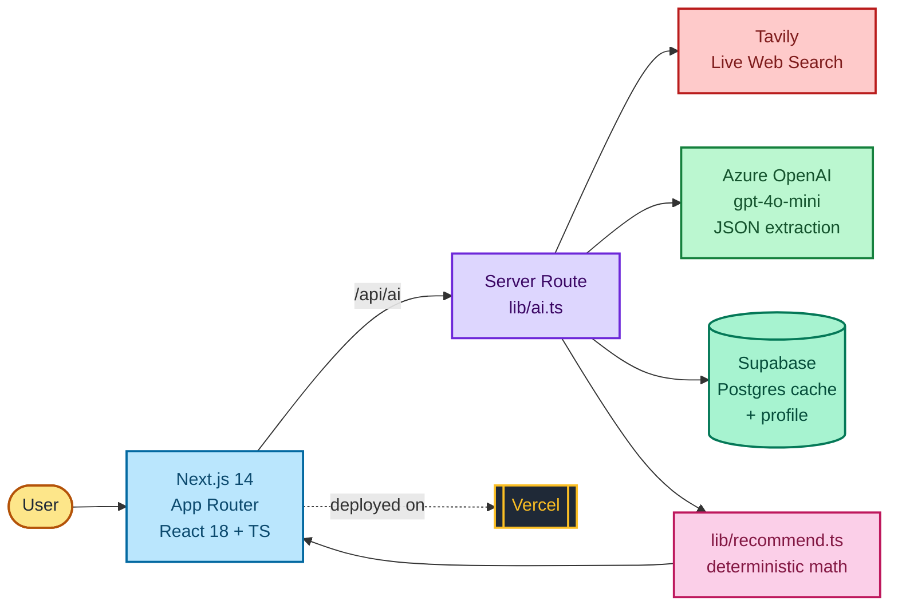

# PointsPilot MVP — Vercel + Azure OpenAI + Tavily + Supabase

Stack decisions: Vercel host, Supabase for cache + profile, no auth yet,
live reward data via web search. ~1 day.

## Tech stack



| Layer | Tool | Why |
|---|---|---|
| Host | **Vercel** | Zero-config Next.js deploys, env vars, edge network |
| Framework | **Next.js 14 (App Router)** | Server routes + React 18 in one repo |
| Language | **TypeScript 5.6** | Typed contracts between AI JSON and UI |
| AI | **Azure OpenAI — gpt-4o-mini** | Cheap structured extraction from search hits |
| Search | **Tavily** | Live web rates, 1k free/mo |
| Data | **Supabase (Postgres)** | 30-day card cache + user profile |
| Logic | **lib/recommend.ts** | Plain math picks the winner — AI never decides |

## How reward data stays fresh and real
Azure OpenAI can't browse on its own. So a card lookup is a 3-step server flow:
```
user types "Amex Gold"
   -> Tavily searches the live web for current rates
   -> Azure OpenAI extracts structured JSON FROM those results (not memory)
   -> cached in Supabase for 30 days, with source links + an asOf date
```
The model never makes up rates — it only reformats what the search returned,
and every card shows its sources so you can verify.

## How recommendations stay correct
`lib/recommend.ts` does the ranking in plain math (multiplier x point value,
plus the trip-priority logic). The AI supplies DATA; the code makes the
DECISION. That's why the recommendation is reliable.

---

## 1. Azure OpenAI
Portal: create an Azure OpenAI / Foundry resource, deploy `gpt-4o-mini`.
Note endpoint, key, deployment name -> into `.env.local`.

## 2. Tavily
Sign up at tavily.com, grab the key (1,000 free searches/month). The 30-day
Supabase cache means you rarely re-search the same card, so you stay in free tier.

## 3. Supabase
Create a project. Open the SQL editor and run `supabase/schema.sql`.
Copy the project URL, anon key, and service-role key into `.env.local`.

## 4. App
```bash
npx create-next-app@latest pointspilot --ts --app --no-tailwind
cd pointspilot
npm i openai @supabase/supabase-js
```
Then copy in from this kit:
- `app/api/ai/route.ts`
- `lib/ai.ts`, `lib/recommend.ts`, `lib/supabase.ts`
- `.env.local.example` -> `.env.local` (fill it in)

In your PointsPilot component (`app/page.tsx`, add `"use client";`):
- delete the inline `aiClassify` / `aiCardLookup` / `normalize` / `rateFor`
- `import { aiClassify, aiCardLookup } from "@/lib/ai";`
- `import { bestForCategory, bestForTrip, rateFor } from "@/lib/recommend";`
- load/save the profile so onboarding runs once:
  ```ts
  import { loadProfile, saveProfile } from "@/lib/supabase";
  useEffect(() => { loadProfile().then(setData); }, []);
  // in Onboarding onDone: saveProfile(payload); setData(payload);
  ```
- show `card.sources` and `card.asOf` somewhere on each card so freshness is visible.

## 5. Run & deploy
```bash
npm run dev
npx vercel    # add all env vars in Vercel project settings, then push
```

---

## Notes / honest limits
- Reward extraction is only as good as the search results. Showing sources +
  asOf lets users sanity-check; that's the right MVP posture.
- `gpt-4o-mini` is cheap and fine for extraction. If accuracy matters more,
  bump to a larger deployment for the cardLookup call only.
- No auth = profiles are device-scoped and the tables are open. Lock down with
  Supabase auth + RLS before any real launch.
- Brave "Data for AI" is a solid Tavily alternative with configurable freshness
  (24h / 7d / 30d) if you want tighter control over how recent results are.
