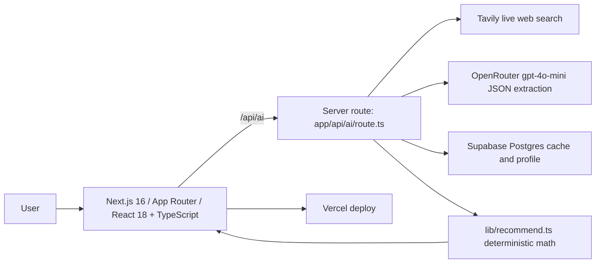

# PointsPilot

> Live, trustworthy credit-card reward lookups and recommendations — built in a day on **Next.js + OpenRouter + Tavily + Supabase + Vercel**.

PointsPilot answers two questions:

1. **"Which of my cards should I use for this purchase?"**
2. **"Which card earns the most for my upcoming trip?"**

The trick: an LLM by itself doesn't know *current* reward rates and will hallucinate them. PointsPilot fixes that by **searching the live web first, then asking the model to extract structured JSON from the search results** — and the *ranking* is done in plain TypeScript, not by the model. Every card surfaces its sources and an `asOf` date so you can verify.

---

## Tech stack



| Layer | Tool | Why |
|---|---|---|
| Host | **Vercel** | Zero-config Next.js deploys, env vars, edge network |
| Framework | **Next.js 16 (App Router)** | Server routes + React 18 in one repo |
| Language | **TypeScript 5.6** | Typed contracts between AI JSON and UI |
| AI gateway | **OpenRouter** (`openai/gpt-4o-mini`) | One key, swap models freely, low cost |
| Search | **Tavily** | Live web rates — 1k free searches/mo |
| Data | **Supabase (Postgres)** | 30-day card cache + authenticated user profile |
| Ranking | **lib/recommend.ts** | Plain math picks the winner — model never decides |

---

## How reward data stays fresh and real

The model can't browse on its own. So a card lookup is a 3-step server flow:

```
user types "Amex Gold"
   -> Tavily searches the live web for current rates
   -> OpenRouter (gpt-4o-mini) extracts structured JSON FROM those results
   -> cached in Supabase for 30 days, with source links + an asOf date
```

The model never invents rates — it only reformats what the search returned, and every card shows its sources.

## How recommendations stay correct

`lib/recommend.ts` does the ranking in plain math — cap-aware effective value, fee-aware net annual value, and fare-aware trip logic. **The AI supplies DATA and a recommendation; the USER makes the final call.** Every surface shows the full ranked field and the math behind it, so the recommendation is reliable *and* auditable. Merchant coding quirks (`lib/merchants.ts`) are deterministic too — the model never ranks.

---

## Repo layout

```
app/
  api/ai/route.ts      # server: rate-limit -> Tavily search -> OpenRouter extract -> JSON
  page.tsx             # client: onboarding + lookup + recommendations UI
  layout.tsx
  globals.css
lib/
  ai.ts                # client-side wrappers around /api/ai
  recommend.ts         # deterministic ranking: cap/fee-aware value, ceiling, trip math
  merchants.ts         # merchant -> category + coding-quirk caveats
  gaps.ts              # wallet coverage summaries without static card offers
  reservations.ts      # pre-filled booking deep links + agent seam
  supabase.ts          # local draft + authenticated profile I/O
supabase/
  schema.sql           # tables: profiles, card_cache, api_rate_limits
.env.local.example     # copy to .env.local and fill in
```

---

## Quick start

### 1. Clone & install

```bash
git clone https://github.com/gwaghmar/pointspilot.git
cd pointspilot
npm install
```

### 2. Provision the three services

| Service | What to do | Free tier |
|---|---|---|
| **OpenRouter** ([keys](https://openrouter.ai/keys)) | Create an API key | Pay-per-token, gpt-4o-mini is ~cents |
| **Tavily** ([tavily.com](https://tavily.com)) | Sign up, copy the API key | 1,000 searches/month |
| **Supabase** ([supabase.com](https://supabase.com)) | New project → SQL editor → paste `supabase/schema.sql` → run | Generous free tier |

### 3. Configure env

```bash
cp .env.local.example .env.local
# fill in all required values
```

```env
OPENROUTER_API_KEY=sk-or-v1-...
OPENROUTER_MODEL=openai/gpt-4o-mini
OPENROUTER_REFERRER=http://localhost:3000
AI_MAX_TEXT_CHARS=2000
AI_RATE_LIMIT_PER_MINUTE=30

TAVILY_API_KEY=tvly-...

NEXT_PUBLIC_SUPABASE_URL=https://YOUR-PROJECT.supabase.co
NEXT_PUBLIC_SUPABASE_ANON_KEY=...
SUPABASE_URL=https://YOUR-PROJECT.supabase.co
SUPABASE_SERVICE_KEY=...
```

### 4. Run

```bash
npm run dev          # http://localhost:3000
npm run typecheck    # tsc --noEmit
npm run build        # production build
```

### 5. Deploy to Vercel

```bash
npx vercel           # links the project
# then paste all env vars into Vercel project settings -> Environment Variables
npx vercel --prod
```

---

## API: `POST /api/ai`

Single server route, two actions, never exposes provider keys to the client.

| Action | Body | Returns |
|---|---|---|
| `classify` | `{ action: "classify", merchant: "Whole Foods" }` | `{ category: "grocery", confidence: 0.93 }` |
| `cardLookup` | `{ action: "cardLookup", cardName: "Amex Gold" }` | `{ name, network, categories[], sources[], asOf }` |

Results from `cardLookup` are cached in Supabase `card_cache` for 30 days keyed by normalized card name.

---

## Honest limits

- Reward extraction is only as good as the search results. Showing `sources` + `asOf` lets users sanity-check; this still needs monitoring and review before a serious public launch.
- `gpt-4o-mini` is cheap and good enough for extraction. Bump to a larger model on the `cardLookup` call alone if accuracy matters more than cost.
- Supabase Auth and RLS are required for server-side profile persistence. Anonymous users should be treated as local drafts, not durable accounts.
- Tavily's free tier is the gate. The 30-day cache means a typical user costs <10 searches/month.
- Brave "Data for AI" is a solid Tavily alternative with configurable freshness (24h / 7d / 30d) if you want tighter recency control.

---

## License

MIT — see [LICENSE](LICENSE).
